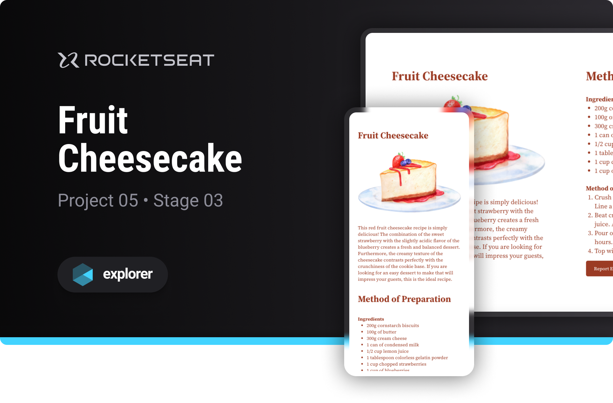

# Recipe Page

Project developed on Rocketseat's Explorer course

**Recipe Page is a landing page designed to learn basic web development concepts**

## 🔗 Project Links

- 🚀 [**Deploy**](https://emanueltavecia.github.io/recipe-page)
- 🎨 [**Figma**](https://www.figma.com/community/file/1256354643188696521/cheesecake-projeto-explorer)

## 📋 Project information

- Rocketseat Explorer
- Stage 03
- Project 05

## 🧠 Concepts learned

The development of this project aims to learn the following concepts:

- Responsiveness
- CSS styling
  - media queries, flex, flexible units of measurement

## 💻 Technologies

## 📄 License

This project is licensed under the MIT License - see the [LICENSE](./LICENSE) file for more details.
